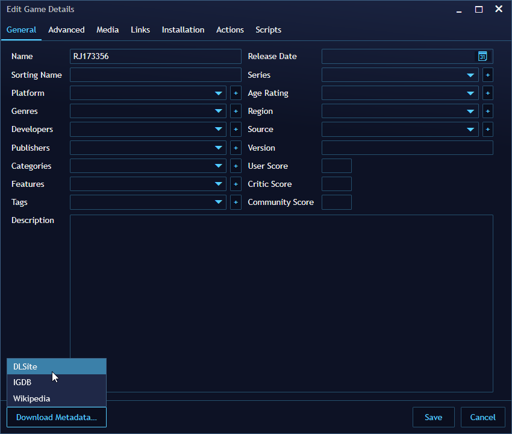

# Extensions for Playnite

Collection of Extensions I created for [Playnite](https://github.com/JosefNemec/Playnite).

- [Installation](#installation)
- [Metadata Providers](#metadata-providers)
  - [DLSite](#dlsite)
- [Troubleshooting](#troubleshooting)

## Installation

1) Get the latest Release from the [Release Tab](https://github.com/erri120/Playnite.Extensions/releases/).
2) Copy the folder to your `Playnite/Extensions/` folder.

## Metadata Providers

### DLSite

**Website**: [ENG](https://www.dlsite.com/ecchi-eng/), [JPN](https://www.dlsite.com/maniax/)

**Supported Fields**:

- Name
- Developers
- Publishers
- Description
- Release Date
- Genres
- Cover Image
- Background Image
- Links

**Usage**:

Copy either the entire URL or just the ID (eg `RE234198` or `RJ173356`) into the Name field, click the _Download Metadata..._ button in the bottom left corner and select _DLSite_.

## Troubleshooting

If an extension is not working correctly, make sure you take a look at the `playnite.log` file in `%appdata%/Roaming/Playnite`.
