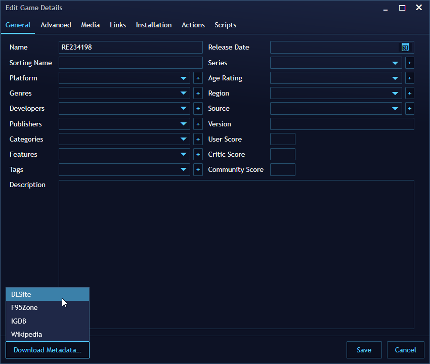
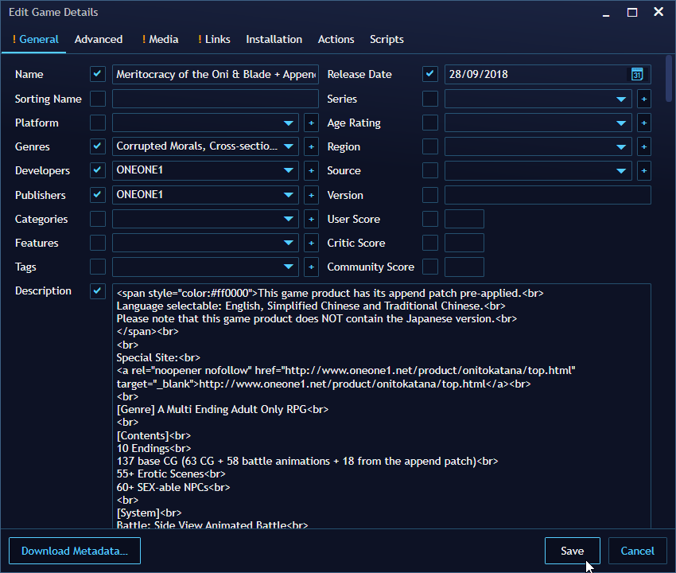
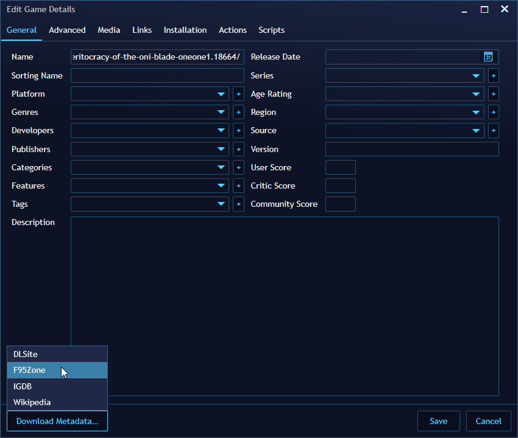
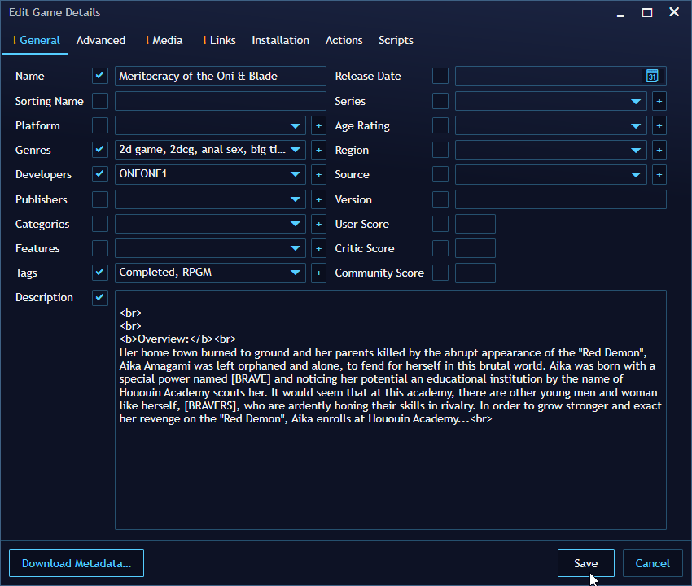
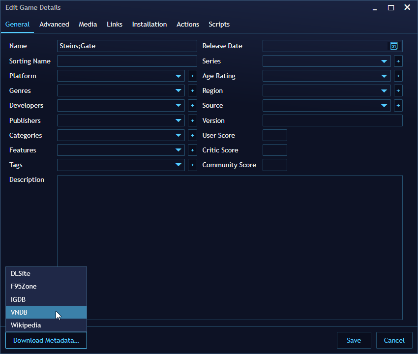
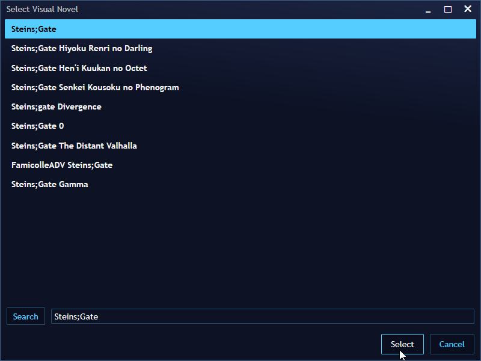
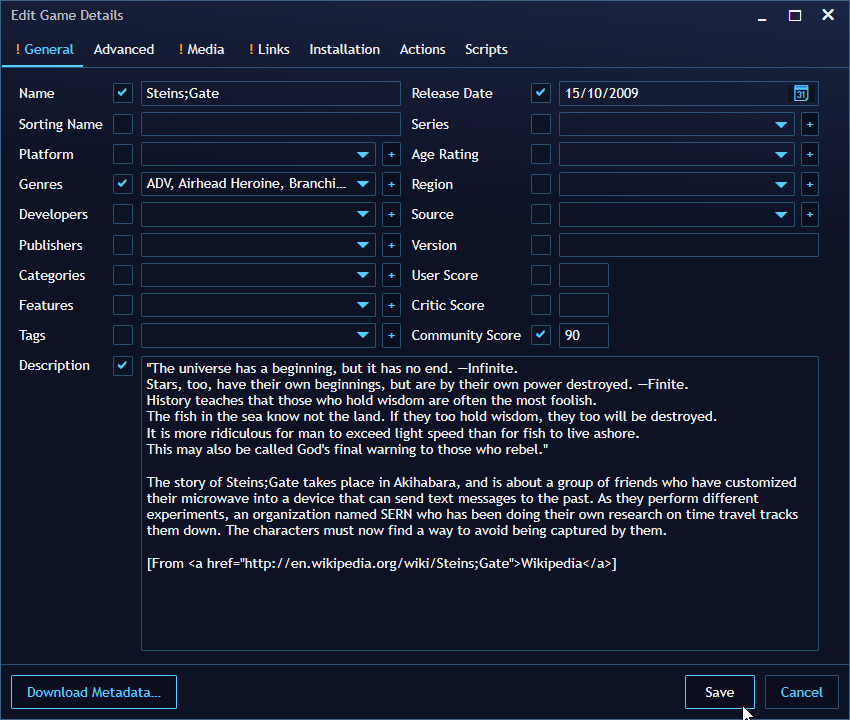
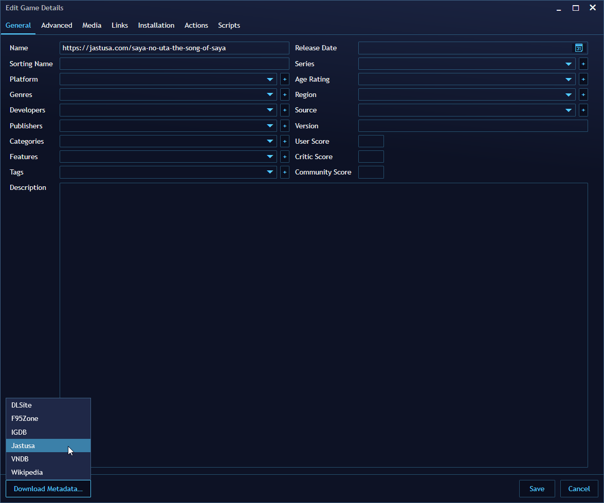
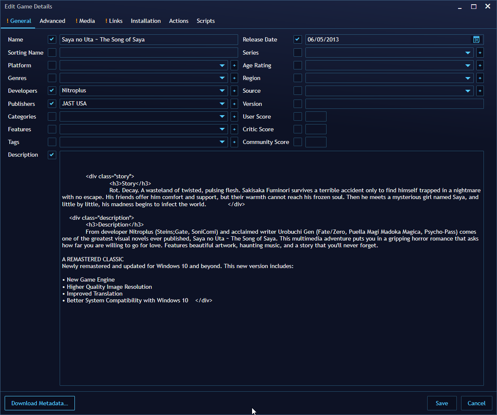

# Extensions for Playnite

[](https://dev.azure.com/erri120/Playnite.Extensions/_build/latest?definitionId=7&branchName=master)

Collection of Extensions I created for [Playnite](https://github.com/JosefNemec/Playnite). Links to forum posts: [F95Zone Forum Post](https://f95zone.to/threads/dlsite-and-f95zone-extensions-for-playnite.56493/), [Playnite Forum Post](https://playnite.link/forum/thread-335.html).

- [Installation](#installation)
- [Metadata Providers](#metadata-providers)
  - [DLSite](#dlsite)
  - [F95Zone](#f95zone)
  - [VNDB](#vndb)
  - [Jastusa](#jastusa)
- [Other Extensions](#other-extensions)
  - [Extensions Updater](#extensions-updater)
  - [Screenshot Plugin](#screenshot-plugin)
- [Troubleshooting](#troubleshooting)

## Installation

1) Get the latest Release from the [Release Tab](https://github.com/erri120/Playnite.Extensions/releases/).
2) Copy the folder to your `Playnite/Extensions/` folder.

## Metadata Providers

### DLSite

**Website**: [ENG](https://www.dlsite.com/ecchi-eng/), [JPN](https://www.dlsite.com/maniax/)

**Supported Fields**:

- Name
- Description
- Developers
- Publishers
- Background Images
- Cover Image
- Genres
- Links
- Release Date

**Usage**:

Copy either the entire URL or just the ID (eg `RE234198` or `RJ173356`) into the Name field, click the _Download Metadata..._ button in the bottom left corner and select _DLSite_.



Change any fields you want afterwards and click the _Save_ button in the bottom right corner.



**JPN to ENG**:

Not every game on DLSite has a page in English. In this case you can end up having the same genres twice: in English and in Japanese. To circumvent this, I added an optional feature for converting JPN genres to ENG. They fortunately have an ID system meaning that eg ID `60` is the same in JPN as it is ENG, that being `女性視点` and `Woman's Viewpoint` respectively.

Loading Metadata for a game can take a bit longer if you have this feature installed because it has to connect to DLSite for every genre it doesn't know the translation of. The translation of course gets cached so the time it takes will decrease the more DLSite games you add.

### F95Zone

**Website**: [F95](https://www.f95zone.to)

**Supported Fields**:

- Name
- Description
- Background Images
- Cover Image
- Developers
- Publishers
- Genres
- Tags
- Links
- Release Date
- Community Score

**Usage**:

Copy the entire URL into the Name field, click the _Download Metadata..._ button in the bottom left corner and select _F95Zone_.



Change any fields you want afterwards and click the _Save_ button in the bottom right corner.



### VNDB

**Website**: [VNDB](https://vndb.org/)

**Supported Fields**:

- Name
- Description
- Cover Image
- Background Image
- Release Date
- Community Score
- Genres
- Links

**Usage**:

You can either use the ID (eg: `v11`), Link (eg: `https://vndb.org/v11`) or Name (eg: `Fate/Stay Night`) of the game in the Name field. Click the _Download Metadata..._ button in the bottom left corner and select _VNDB_.



You will get a list of search results if you used the Name of the game.



Change any fields you want afterwards and click the _Save_ button in the bottom right corner.



### Jastusa

**Website**: [Jastusa](https://jastusa.com)

**Supported Fields**:

- Name
- Description
- Developers
- Publishers
- Links
- Cover Image
- Background Images
- Release Date

**Usage**:

Copy the entire URL into the Name field, click the _Download Metadata..._ button in the bottom left corner and select _Jastusa_.



Change any fields you want afterwards and click the _Save_ button in the bottom right corner.



## Other Extensions

### Extensions Updater

This is a generic plugin which can check if your extension needs an update. It does this by looking in your `extension.yaml` file for a new setting:

```yaml
UpdaterConfig:
  GitHubUser: erri120
  GitHubRepo: Playnite.Extensions
```

The GitHub API is used to fetch the releases from `https://api.github.com/repos/{user}/{repo}/releases` (eg: `https://api.github.com/repos/erri120/Playnite.Extensions/releases`) and then it will try to find out if a new release is available. The plugin will use the version defined in your `extension.yaml` and the tag defined in your GitHub release. If you use _normal_ versioning (eg: `1.2.3` or `v1.2.3`) then we can just call `Version.TryParse` and compare the resulting versions. If this does not work then we will just check if the strings are different using `sCurrentVersion.Equals(sLatestVersion, StringComparison.OrdinalIgnoreCase)`.

The user will get a notification if an update is available and the GitHub release site for the latest release will open if they click the notification.

### Screenshot Plugin

Plugin made using parts of the [ShareX](https://github.com/ShareX/ShareX) [ScreenCaptureLib](https://github.com/ShareX/ShareX/tree/master/ShareX.ScreenCaptureLib). This little plugin will capture different region on when pressing a hotkey. Those regions can be:

- everything
- current active monitor
- current active window

The screenshots will be saved to a configurable path.

Big thanks to [ShareX](https://github.com/ShareX/ShareX) for the capturing code and [Alexey Golub](https://tyrrrz.me/) for the Hotkey control and registration.

## Troubleshooting

If an extension is not working correctly, make sure you take a look at the `playnite.log` file in `%appdata%/Playnite`.
